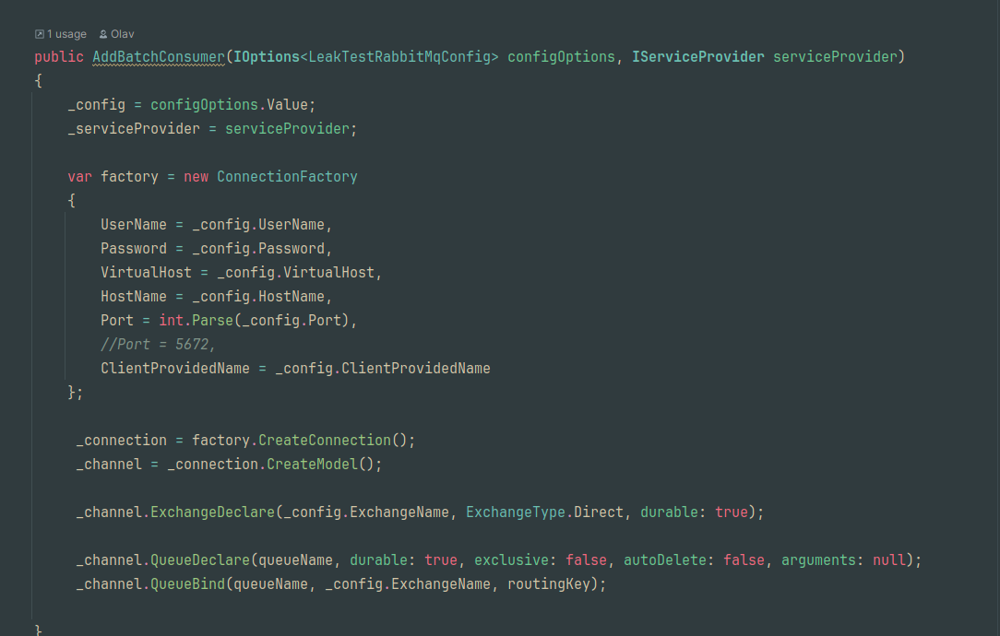

# Everforest Dark
This theme is inspired by the [existing everforest](https://plugins.jetbrains.com/plugin/20336-everforest-theme) theme pack for JetBrains IDE's made by Martin Franc,
and the [vim everforest theme](https://github.com/sainnhe/everforest) by Sainnhe. 

# Installation
To install this plugin go to Settings -> Plugins and search for everforest-dark. Click install, apply and ok.

Alternatively clone this repo, open it in IntelliJ Idea, build it and prepare the plugin for deployment (default `alt+b` and then select "Prepare Plugin Module 'everforest-dark' For Deployment).
This will export a .jar which you can use to install the theme from disk. To do that, go to: Settings -> Plugins and click the cog and select "Install Plugin from Disk". Select the
.jar file and hit ok.

# Contribution
I have only provided language specific syntax highlighting for C# and Python, since those are the only languages i currently use. If you want to provide highlighting for different languages
it would be most appreciated.

# Screenshots

C#

Python

